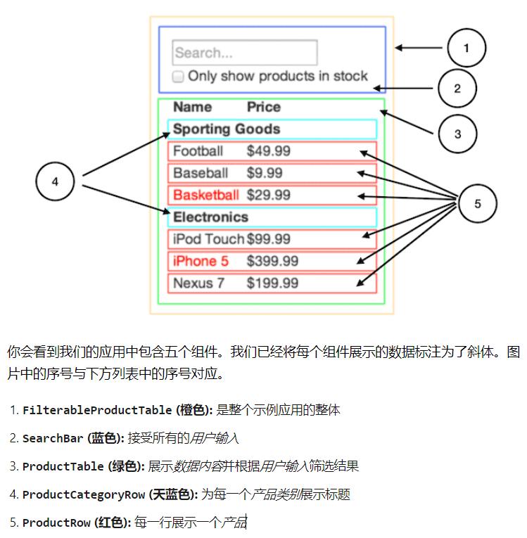

## first-react

根据 react 官方文档 thinking in react 章节实现的小组件，麻雀虽小，五脏俱全，对 react 组件开发有了基本认识。

在线预览：https://first-react.pages.dev/

本地预览：

1. 克隆项目 `git clone git@github.com:huangsiyuan2015/first-react.git`
2. 安装依赖 `yarn`
3. 启动项目 `yarn start`
4. 启动接口 `yarn server`

